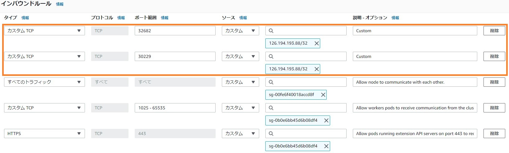

# 20210525-LT Service公開


# NodePort タイプでService公開
1. テスト用のサンプルアプリの Deployment を作成してデプロイ
    ```YAML
    cat <<EOF > nginx-deployment.yaml
    apiVersion: apps/v1
    kind: Deployment
    metadata:
      name: nginx-deployment
      labels:
        app: nginx
    spec:
      replicas: 2
      selector:
        matchLabels:
          app: nginx
      template:
        metadata:
          labels:
            app: nginx
        spec:
          containers:
          - name: nginx
            image: nginx:1.14.2
            ports:
            - containerPort: 80
    EOF
    ```

    ```YAML
    cat <<EOF > hello-world-deployment.yaml
    apiVersion: apps/v1
    kind: Deployment
    metadata:
      name: f5-hello-world-web
      namespace: default
    spec:
      replicas: 2
      selector:
        matchLabels:
          app: f5-hello-world-web
      template:
        metadata:
          labels:
            app: f5-hello-world-web
        spec:
          containers:
          - env:
            - name: service_name
              value: f5-hello-world-web
            image: f5devcentral/f5-hello-world:latest
            imagePullPolicy: IfNotPresent
            name: f5-hello-world-web
            ports:
            - containerPort: 8080
              protocol: TCP
    EOF
    ```

    デプロイ
    ```
    kubectl apply -f nginx-deployment.yaml
    kubectl apply -f hello-world-deployment.yaml
    ```

1. 確認
    ```
    kubectl get pods -o wide

    NAME                                  READY   STATUS    RESTARTS   AGE   IP             NODE                           NOMINATED NODE   READINESS GATES
    f5-hello-world-web-58b6859486-m6nj4   1/1     Running   0          19s   10.1.10.170    ip-10-1-10-70.ec2.internal     <none>           <none>
    f5-hello-world-web-58b6859486-pft6n   1/1     Running   0          19s   10.1.110.243   ip-10-1-110-249.ec2.internal   <none>           <none>
    nginx-deployment-66b6c48dd5-882j9     1/1     Running   0          20s   10.1.110.171   ip-10-1-110-249.ec2.internal   <none>           <none>
    nginx-deployment-66b6c48dd5-vhpdb     1/1     Running   0          20s   10.1.10.71     ip-10-1-10-70.ec2.internal     <none>           <none>
    ```

1. NodePort で Service を作成してデプロイ
    ```YAML
    cat <<EOF > nodeport.yaml
    apiVersion: v1
    kind: Service
    metadata:
      name: nginx-service-nodeport
    spec:
      type: NodePort
      selector:
        app: nginx
      ports:
        - protocol: TCP
          port: 80
          targetPort: 80
    EOF
    ```
    ```YAML
    cat <<EOF > nodeport-service-hello-world.yaml
    apiVersion: v1
    kind: Service
    metadata:
      name: f5-hello-world-service-nodeport
      namespace: default
    spec:
      type: NodePort
      ports:
      - name: f5-hello-world-web
        port: 8080
        protocol: TCP
        targetPort: 8080
      selector:
        app: f5-hello-world-web
    EOF
    ```

    Service のデプロイ
    ```
    kubectl create -f nodeport.yaml
    kubectl create -f nodeport-service-hello-world.yaml
    ```

1. 確認
    ```
    kubectl get pods,svc -o wide

    NAME                                      READY   STATUS    RESTARTS   AGE     IP             NODE                           NOMINATED NODE   READINESS GATES
    pod/f5-hello-world-web-58b6859486-m6nj4   1/1     Running   0          6m27s   10.1.10.170    ip-10-1-10-70.ec2.internal     <none>           <none>
    pod/f5-hello-world-web-58b6859486-pft6n   1/1     Running   0          6m27s   10.1.110.243   ip-10-1-110-249.ec2.internal   <none>           <none>
    pod/nginx-deployment-66b6c48dd5-882j9     1/1     Running   0          6m28s   10.1.110.171   ip-10-1-110-249.ec2.internal   <none>           <none>
    pod/nginx-deployment-66b6c48dd5-vhpdb     1/1     Running   0          6m28s   10.1.10.71     ip-10-1-10-70.ec2.internal     <none>           <none>

    NAME                                      TYPE        CLUSTER-IP      EXTERNAL-IP   PORT(S)          AGE   SELECTOR
    service/f5-hello-world-service-nodeport   NodePort    172.20.171.5    <none>        8080:30229/TCP   33s   app=f5-hello-world-web
    service/kubernetes                        ClusterIP   172.20.0.1      <none>        443/TCP          12h   <none>
    service/nginx-service-nodeport            NodePort    172.20.47.207   <none>        80:32682/TCP     33s   app=nginx
    ```

1. NodePortで接続テストするために、セキュリティグループを変更  
※一時的にクラスター外・インターネットからのアクセスを許可

    

1. 確認

    


# LoadBalancer タイプでService公開


# Ingress Controller を使ってService公開


