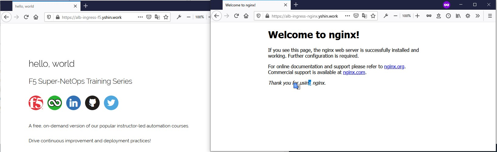

# 20210525-LT Service公開


# NodePort タイプでService公開
1. テスト用のサンプルWEBページの Deployment を作成
    ```YAML
    cat <<EOF > deployment-nginx.yaml
    apiVersion: apps/v1
    kind: Deployment
    metadata:
      name: nginx
      labels:
        app: nginx
    spec:
      replicas: 2
      selector:
        matchLabels:
          app: nginx
      template:
        metadata:
          labels:
            app: nginx
        spec:
          containers:
          - name: nginx
            image: nginx:1.14.2
            ports:
            - containerPort: 80
    EOF
    ```

    ```YAML
    cat <<EOF > deployment-f5-hello-world.yaml
    apiVersion: apps/v1
    kind: Deployment
    metadata:
      name: f5-hello-world-web
      namespace: default
    spec:
      replicas: 2
      selector:
        matchLabels:
          app: f5-hello-world-web
      template:
        metadata:
          labels:
            app: f5-hello-world-web
        spec:
          containers:
          - env:
            - name: service_name
              value: f5-hello-world-web
            image: f5devcentral/f5-hello-world:latest
            imagePullPolicy: IfNotPresent
            name: f5-hello-world-web
            ports:
            - containerPort: 8080
              protocol: TCP
    EOF
    ```

    Podsの作成
    ```
    kubectl apply -f deployment-nginx.yaml
    kubectl apply -f deployment-f5-hello-world.yaml
    ```

1. 確認
    ```
    kubectl get pods -o wide

    NAME                                  READY   STATUS    RESTARTS   AGE   IP             NODE                           NOMINATED NODE   READINESS GATES
    f5-hello-world-web-58b6859486-m6nj4   1/1     Running   0          19s   10.1.10.170    ip-10-1-10-70.ec2.internal     <none>           <none>
    f5-hello-world-web-58b6859486-pft6n   1/1     Running   0          19s   10.1.110.243   ip-10-1-110-249.ec2.internal   <none>           <none>
    nginx-66b6c48dd5-882j9     1/1     Running   0          20s   10.1.110.171   ip-10-1-110-249.ec2.internal   <none>           <none>
    nginx-66b6c48dd5-vhpdb     1/1     Running   0          20s   10.1.10.71     ip-10-1-10-70.ec2.internal     <none>           <none>
    ```

1. NodePort で Service の作成
    ```YAML
    cat <<EOF > service-nginx-nodeport.yaml
    apiVersion: v1
    kind: Service
    metadata:
      name: nginx-service-nodeport
    spec:
      type: NodePort
      selector:
        app: nginx
      ports:
        - protocol: TCP
          port: 80
          targetPort: 80
    EOF
    ```
    ```YAML
    cat <<EOF > service-f5-hello-world-nodeport.yaml
    apiVersion: v1
    kind: Service
    metadata:
      name: f5-hello-world-service-nodeport
      namespace: default
    spec:
      type: NodePort
      ports:
      - name: f5-hello-world-web
        port: 8080
        protocol: TCP
        targetPort: 8080
      selector:
        app: f5-hello-world-web
    EOF
    ```

    Service の作成
    ```
    kubectl apply -f service-nginx-nodeport.yaml
    kubectl apply -f service-f5-hello-world-nodeport.yaml
    ```

1. 確認
    ```
    kubectl get pods,svc -o wide

    NAME                                      READY   STATUS    RESTARTS   AGE     IP             NODE                           NOMINATED NODE   READINESS GATES
    pod/f5-hello-world-web-58b6859486-m6nj4   1/1     Running   0          6m27s   10.1.10.170    ip-10-1-10-70.ec2.internal     <none>           <none>
    pod/f5-hello-world-web-58b6859486-pft6n   1/1     Running   0          6m27s   10.1.110.243   ip-10-1-110-249.ec2.internal   <none>           <none>
    pod/nginx-66b6c48dd5-882j9     1/1     Running   0          6m28s   10.1.110.171   ip-10-1-110-249.ec2.internal   <none>           <none>
    pod/nginx-66b6c48dd5-vhpdb     1/1     Running   0          6m28s   10.1.10.71     ip-10-1-10-70.ec2.internal     <none>           <none>

    NAME                                      TYPE        CLUSTER-IP      EXTERNAL-IP   PORT(S)          AGE   SELECTOR
    service/f5-hello-world-service-nodeport   NodePort    172.20.171.5    <none>        8080:30229/TCP   33s   app=f5-hello-world-web
    service/kubernetes                        ClusterIP   172.20.0.1      <none>        443/TCP          12h   <none>
    service/nginx-service-nodeport            NodePort    172.20.47.207   <none>        80:32682/TCP     33s   app=nginx
    ```

1. NodePortで接続テストするために、セキュリティグループを変更  
※一時的にクラスター外・インターネットからのアクセスを許可

    

1. ブラウザから確認

    


1. Podからみた送信元IPは？

    

    ```
    kubectl get nodes,pods,svc -o wide -A

    NAME                                STATUS   ROLES    AGE   VERSION              INTERNAL-IP    EXTERNAL-IP     OS-IMAGE         KERNEL-VERSION                CONTAINER-RUNTIME
    node/ip-10-1-10-70.ec2.internal     Ready    <none>   13h   v1.19.6-eks-49a6c0   10.1.10.70     3.91.184.163    Amazon Linux 2   5.4.117-58.216.amzn2.x86_64   docker://19.3.13
    node/ip-10-1-110-249.ec2.internal   Ready    <none>   13h   v1.19.6-eks-49a6c0   10.1.110.249   44.192.65.203   Amazon Linux 2   5.4.117-58.216.amzn2.x86_64   docker://19.3.13

    NAMESPACE     NAME                                      READY   STATUS    RESTARTS   AGE   IP             NODE                           NOMINATED NODE   READINESS GATES
    default       pod/f5-hello-world-web-58b6859486-m6nj4   1/1     Running   0          35m   10.1.10.170    ip-10-1-10-70.ec2.internal     <none>           <none>
    default       pod/f5-hello-world-web-58b6859486-pft6n   1/1     Running   0          35m   10.1.110.243   ip-10-1-110-249.ec2.internal   <none>           <none>
    default       pod/nginx-66b6c48dd5-882j9     1/1     Running   0          35m   10.1.110.171   ip-10-1-110-249.ec2.internal   <none>           <none>
    default       pod/nginx-66b6c48dd5-vhpdb     1/1     Running   0          35m   10.1.10.71     ip-10-1-10-70.ec2.internal     <none>           <none>
    kube-system   pod/aws-node-gl9tj                        1/1     Running   0          13h   10.1.10.70     ip-10-1-10-70.ec2.internal     <none>           <none>
    kube-system   pod/aws-node-lvklk                        1/1     Running   0          13h   10.1.110.249   ip-10-1-110-249.ec2.internal   <none>           <none>
    kube-system   pod/coredns-7d74b564bd-mg575              1/1     Running   0          13h   10.1.10.189    ip-10-1-10-70.ec2.internal     <none>           <none>
    kube-system   pod/coredns-7d74b564bd-zh7bh              1/1     Running   0          13h   10.1.110.149   ip-10-1-110-249.ec2.internal   <none>           <none>
    kube-system   pod/kube-proxy-hrchz                      1/1     Running   0          13h   10.1.110.249   ip-10-1-110-249.ec2.internal   <none>           <none>
    kube-system   pod/kube-proxy-x7b9x                      1/1     Running   0          13h   10.1.10.70     ip-10-1-10-70.ec2.internal     <none>           <none>

    NAMESPACE     NAME                                      TYPE        CLUSTER-IP      EXTERNAL-IP   PORT(S)          AGE   SELECTOR
    default       service/f5-hello-world-service-nodeport   NodePort    172.20.171.5    <none>        8080:30229/TCP   29m   app=f5-hello-world-web
    default       service/kubernetes                        ClusterIP   172.20.0.1      <none>        443/TCP          13h   <none>
    default       service/nginx-service-nodeport            NodePort    172.20.47.207   <none>        80:32682/TCP     29m   app=nginx
    kube-system   service/kube-dns                          ClusterIP   172.20.0.10     <none>        53/UDP,53/TCP    13h   k8s-app=kube-dns
    ```

1. 一時的に許可したセキュリティグループを閉じる

1. Service削除

    ```
    kubectl delete service nginx-service-nodeport
    kubectl delete service f5-hello-world-service-nodeport
    ```


# LoadBalancer タイプでService公開

※ L4レベルの負荷分散  
※ ホスト名でのService振り分け、URIベースの振り分けが必要ない場合など  

## Classic Load Balancer (CLB) でサービスを公開

1. type: ``` LoadBalancer```で作成

    ```YAML
    cat <<EOF > service-lb-nginx1.yaml
    apiVersion: v1
    kind: Service
    metadata:
      name: nginx-service-loadbalancer
    spec:
      type: LoadBalancer
      selector:
        app: nginx
      ports:
        - protocol: TCP
          port: 80
          targetPort: 80
    EOF
    ```

    ```YAML
    cat <<EOF > service-lb-f5-web.yaml
    apiVersion: v1
    kind: Service
    metadata:
      name: f5-hello-world-service-loadbalancer
    spec:
      type: LoadBalancer
      selector:
        app: f5-hello-world-web
      ports:
        - protocol: TCP
          port: 80
          targetPort: 8080
    EOF
    ```
 
    作成
    ```
    kubectl apply -f service-lb-nginx1.yaml
    kubectl apply -f service-lb-f5-web.yaml
    ```

1. 確認
    ```
    $ kubectl get nodes,pods,svc -o wide

    NAME                                STATUS   ROLES    AGE   VERSION              INTERNAL-IP    EXTERNAL-IP     OS-IMAGE         KERNEL-VERSION                CONTAINER-RUNTIME
    node/ip-10-1-10-70.ec2.internal     Ready    <none>   15h   v1.19.6-eks-49a6c0   10.1.10.70     3.91.184.163    Amazon Linux 2   5.4.117-58.216.amzn2.x86_64   docker://19.3.13
    node/ip-10-1-110-249.ec2.internal   Ready    <none>   15h   v1.19.6-eks-49a6c0   10.1.110.249   44.192.65.203   Amazon Linux 2   5.4.117-58.216.amzn2.x86_64   docker://19.3.13

    NAME                                      READY   STATUS    RESTARTS   AGE    IP             NODE                           NOMINATED NODE   READINESS GATES
    pod/f5-hello-world-web-58b6859486-m6nj4   1/1     Running   0          168m   10.1.10.170    ip-10-1-10-70.ec2.internal     <none>           <none>
    pod/f5-hello-world-web-58b6859486-pft6n   1/1     Running   0          168m   10.1.110.243   ip-10-1-110-249.ec2.internal   <none>           <none>
    pod/nginx-66b6c48dd5-882j9     1/1     Running   0          168m   10.1.110.171   ip-10-1-110-249.ec2.internal   <none>           <none>
    pod/nginx-66b6c48dd5-vhpdb     1/1     Running   0          168m   10.1.10.71     ip-10-1-10-70.ec2.internal     <none>           <none>

    NAME                                          TYPE           CLUSTER-IP      EXTERNAL-IP                                                               PORT(S)        AGE   SELECTOR
    service/f5-hello-world-service-loadbalancer   LoadBalancer   172.20.186.23   a2801d45c974d41f9a5aa83614b04071-1071771739.us-east-1.elb.amazonaws.com   80:30145/TCP   49s   app=f5-hello-world-web
    service/kubernetes                            ClusterIP      172.20.0.1      <none>                                                                    443/TCP        15h   <none>
    service/nginx-service-loadbalancer            LoadBalancer   172.20.214.43   a64b64542554f41f5a76e3d89f275840-1838091353.us-east-1.elb.amazonaws.com   80:30304/TCP   50s   app=nginx
    ```

1. 作成されたELB

    ※ デフォルトだとCLBで作成される  
    ※ ELBが都度作成されて、外部公開サービスが多いと課金がすごいことになっちゃう

    

1. ブラウザから接続

    ※ 数秒でアクセスできる

    


## Network Load Balancer (NLB) でサービスを公開

※ ターゲットタイプがインスタンスまたは IP ターゲット  
※ NLB をプロビジョニングする場合は、AWS Load Balancer Controller の使用を推奨されているとの記載・・・  

  [Network load balancing on Amazon EKS](https://https://docs.amazonaws.cn/en_us/eks/latest/userguide/network-load-balancing.html/)
  > Important
  With the 2.2.0 release of the AWS Load Balancer Controller, the Kubernetes in-tree service load balancer controller is deprecated, and is only receiving critical bug fixes. When provisioning new network load balancers for Services of type LoadBalancer, we recommend using the AWS Load Balancer Controller. The information in this topic assumes that you're using the AWS Load Balancer Controller, not the Kubernetes in-tree controller.

### NLB の Instance

1. NLBのアノテーションをつける

    ```YAML
    cat <<EOF > service-nlb-nginx1.yaml
    apiVersion: v1
    kind: Service
    metadata:
      name: nginx-service-loadbalancer
      annotations:
        service.beta.kubernetes.io/aws-load-balancer-type: "nlb"
    spec:
      type: LoadBalancer
      selector:
        app: nginx
      ports:
        - protocol: TCP
          port: 80
          targetPort: 80
    EOF
    ```

    ```YAML
    cat <<EOF > service-nlb-f5-web.yaml
    apiVersion: v1
    kind: Service
    metadata:
      name: f5-hello-world-service-loadbalancer
      annotations:
        service.beta.kubernetes.io/aws-load-balancer-type: "nlb"
    spec:
      type: LoadBalancer
      selector:
        app: f5-hello-world-web
      ports:
        - protocol: TCP
          port: 80
          targetPort: 8080
    EOF
    ```

1. 作成

    ```
    kubectl apply -f service-nlb-nginx1.yaml
    kubectl apply -f service-nlb-f5-web.yaml
    ```

1. 確認

    ```
    kubectl get nodes,pods,svc -o wide -A

    NAME                                STATUS   ROLES    AGE   VERSION              INTERNAL-IP    EXTERNAL-IP     OS-IMAGE         KERNEL-VERSION                CONTAINER-RUNTIME
    node/ip-10-1-10-70.ec2.internal     Ready    <none>   16h   v1.19.6-eks-49a6c0   10.1.10.70     3.91.184.163    Amazon Linux 2   5.4.117-58.216.amzn2.x86_64   docker://19.3.13
    node/ip-10-1-110-249.ec2.internal   Ready    <none>   16h   v1.19.6-eks-49a6c0   10.1.110.249   44.192.65.203   Amazon Linux 2   5.4.117-58.216.amzn2.x86_64   docker://19.3.13

    NAMESPACE     NAME                                      READY   STATUS    RESTARTS   AGE     IP             NODE                           NOMINATED NODE   READINESS GATES
    default       pod/f5-hello-world-web-58b6859486-m6nj4   1/1     Running   0          3h28m   10.1.10.170    ip-10-1-10-70.ec2.internal     <none>           <none>
    default       pod/f5-hello-world-web-58b6859486-pft6n   1/1     Running   0          3h28m   10.1.110.243   ip-10-1-110-249.ec2.internal   <none>           <none>
    default       pod/nginx-66b6c48dd5-882j9     1/1     Running   0          3h28m   10.1.110.171   ip-10-1-110-249.ec2.internal   <none>           <none>
    default       pod/nginx-66b6c48dd5-vhpdb     1/1     Running   0          3h28m   10.1.10.71     ip-10-1-10-70.ec2.internal     <none>           <none>
    kube-system   pod/aws-node-gl9tj                        1/1     Running   0          16h     10.1.10.70     ip-10-1-10-70.ec2.internal     <none>           <none>
    kube-system   pod/aws-node-lvklk                        1/1     Running   0          16h     10.1.110.249   ip-10-1-110-249.ec2.internal   <none>           <none>
    kube-system   pod/coredns-7d74b564bd-mg575              1/1     Running   0          16h     10.1.10.189    ip-10-1-10-70.ec2.internal     <none>           <none>
    kube-system   pod/coredns-7d74b564bd-zh7bh              1/1     Running   0          16h     10.1.110.149   ip-10-1-110-249.ec2.internal   <none>           <none>
    kube-system   pod/kube-proxy-hrchz                      1/1     Running   0          16h     10.1.110.249   ip-10-1-110-249.ec2.internal   <none>           <none>
    kube-system   pod/kube-proxy-x7b9x                      1/1     Running   0          16h     10.1.10.70     ip-10-1-10-70.ec2.internal     <none>           <none>

    NAMESPACE     NAME                                          TYPE           CLUSTER-IP       EXTERNAL-IP                                                                     PORT(S)         AGE    SELECTOR
    default       service/f5-hello-world-service-loadbalancer   LoadBalancer   172.20.224.232   a3146accecf1e446ca5a0c237db73a27-9acb96df085d54f5.elb.us-east-1.amazonaws.com   80:32405/TCP    4m8s   app=f5-hello-world-web
    default       service/kubernetes                            ClusterIP      172.20.0.1       <none>                                                                          443/TCP         16h    <none>
    default       service/nginx-service-loadbalancer            LoadBalancer   172.20.229.168   acdf3d2f964264f7eba67cc9c3db3d51-3a52e4fdd5d79811.elb.us-east-1.amazonaws.com   80:30138/TCP    4m8s   app=nginx
    kube-system   service/kube-dns                              ClusterIP      172.20.0.10      <none>                                                                          53/UDP,53/TCP   16h    k8s-app=kube-dns
    ```

1. 作成れたELB

    ※ ```service.beta.kubernetes.io/aws-load-balancer-type: "nlb"``` アノテーションをつけたらNLBで作成される  

    

    ※ Target Group はインスタンスになる
    


1. ブラウザからアクセス確認

    

    送信元はKube-proxyのIPアドレス  
    

    この英語が理解できなかった・・・  
    [Network load balancing on Amazon EKS](https://https://docs.amazonaws.cn/en_us/eks/latest/userguide/network-load-balancing.html/)  
    > Note
    The service.beta.kubernetes.io/aws-load-balancer-type: "nlb-ip" annotation is still supported for backwards compatibility, but we recommend using the previous annotations for new load balancers instead of service.beta.kubernetes.io/aws-load-balancer-type: "nlb-ip".  

    AWS Load Balancer Controller をインストールしないで、NLBを使う場合、
    ```service.beta.kubernetes.io/aws-load-balancer-nlb-target-type: "ip"```  か、```service.beta.kubernetes.io/aws-load-balancer-type: "nlb-ip"```  どっち使えば良いのかわからい。。。  


### NLB の service.beta.kubernetes.io/aws-load-balancer-nlb-target-type: "ip" でやってみる

  [Network load balancing on Amazon EKS](https://docs.amazonaws.cn/en_us/eks/latest/userguide/network-load-balancing.html#network-load-balancing-service-sample-manifest)


1. NLB 作成 "ip"

    ```YAML
    cat <<EOF > service-nlb-ip-nginx1.yaml
    apiVersion: v1
    kind: Service
    metadata:
      name: nginx-service-loadbalancer
      annotations:
        service.beta.kubernetes.io/aws-load-balancer-type: external
        service.beta.kubernetes.io/aws-load-balancer-nlb-target-type: ip
        service.beta.kubernetes.io/aws-load-balancer-scheme: internet-facing
    spec:
      type: LoadBalancer
      selector:
        app: nginx
      ports:
        - protocol: TCP
          port: 80
          targetPort: 80
    EOF
    ```

    ```YAML
    cat <<EOF > service-nlb-ip-f5-web.yaml
    apiVersion: v1
    kind: Service
    metadata:
      name: f5-hello-world-service-loadbalancer
      annotations:
        service.beta.kubernetes.io/aws-load-balancer-type: external
        service.beta.kubernetes.io/aws-load-balancer-nlb-target-type: ip
        service.beta.kubernetes.io/aws-load-balancer-scheme: internet-facing
    spec:
      type: LoadBalancer
      selector:
        app: f5-hello-world-web
      ports:
        - protocol: TCP
          port: 80
          targetPort: 8080
    EOF
    ```

1. 作成
    ```
    kubectl apply -f service-nlb-ip-nginx1.yaml
    kubectl apply -f service-nlb-ip-f5-web.yaml
    ```

1. 確認

    ※ pending のまま作成されない
    ```
    kubectl get svc -o wide

    NAME                                  TYPE           CLUSTER-IP       EXTERNAL-IP   PORT(S)        AGE     SELECTOR
    f5-hello-world-service-loadbalancer   LoadBalancer   172.20.230.212   <pending>     80:31363/TCP   2m26s   app=f5-hello-world-web
    ```

1. 削除
    ```
    kubectl delete service nginx-service-loadbalancer
    kubectl delete service f5-hello-world-service-loadbalancer
    ```

### NLB の service.beta.kubernetes.io/aws-load-balancer-type: "nlb-ip" でやってみる

1. 作成

    ```YAML
    cat <<EOF > service-nlb-ip2-nginx1.yaml
    apiVersion: v1
    kind: Service
    metadata:
      name: nginx-service-loadbalancer
      annotations:
        service.beta.kubernetes.io/aws-load-balancer-type: "nlb-ip"
        service.beta.kubernetes.io/aws-load-balancer-scheme: "internet-facing"
    spec:
      type: LoadBalancer
      selector:
        app: nginx
      ports:
        - protocol: TCP
          port: 80
          targetPort: 80
    EOF
    ```

    ```YAML
    cat <<EOF > service-nlb-ip2-f5-web.yaml
    apiVersion: v1
    kind: Service
    metadata:
      name: f5-hello-world-service-loadbalancer
      annotations:
        service.beta.kubernetes.io/aws-load-balancer-type: "nlb-ip"
        service.beta.kubernetes.io/aws-load-balancer-scheme: "internet-facing"
    spec:
      type: LoadBalancer
      selector:
        app: f5-hello-world-web
      ports:
        - protocol: TCP
          port: 80
          targetPort: 8080
    EOF
    ```

1. 作成
    ```
    kubectl apply -f service-nlb-ip2-nginx1.yaml
    kubectl apply -f service-nlb-ip2-f5-web.yaml
    ```

1. 確認

    ※ pending のまま作成されない
    ```
    kubectl get svc -o wide -A

    NAMESPACE     NAME                                  TYPE           CLUSTER-IP       EXTERNAL-IP   PORT(S)         AGE   SELECTOR
    default       f5-hello-world-service-loadbalancer   LoadBalancer   172.20.206.190   <pending>     80:31779/TCP    16s   app=f5-hello-world-web
    ```

1. 削除
    ```
    kubectl delete service nginx-service-loadbalancer
    kubectl delete service f5-hello-world-service-loadbalancer
    ```

NLBのターゲットグループのIPタイプは確認できず・・・・


# Ingress Controller を使ってService公開

※ Ingress Controller の種類 : [Ingress Controller](https://kubernetes.io/ja/docs/concepts/services-networking/ingress-controllers/#additional-controllers)  
※ L7 ホスト名、URI Path ベースのルーティング  
※ HTTP/HTTPS が対象  

## AWS Load Balancer Controller でサービス公開 

  ※ AWS 版 の Ingress Controller でAWS ALBが利用される  
  ※「AWS ALB Ingress Controller」から「AWS Load Balancer Controller」に名前が変わった  

### AWS Load Balancer Controller のインストール前にServiceAccountを作成

  [Load Balancer Controller Installation](https://kubernetes-sigs.github.io/aws-load-balancer-controller/v2.2/deploy/installation/)

1. AWS Load Balancer ControllerのIAMポリシーをダウンロード

    ```
    curl -o iam_policy.json https://raw.githubusercontent.com/kubernetes-sigs/aws-load-balancer-controller/v2.2.0/docs/install/iam_policy.json
    ```


1. ダウンロードしたポリシーを使用してIAMポリシーを作成

    ```
    aws iam create-policy \
        --policy-name AWSLoadBalancerControllerIAMPolicy \
        --policy-document file://iam_policy.json
    ```
    ※ 作成されたARNをコピーしておく  
    ※ 既に同一名で作成済みの場合はコマンドで確認する  
        ```aws iam list-policies --scope Local```

      ```
      aws iam list-policies --scope Local
      ...
      ...
      ...
        {
            "PolicyName": "AWSLoadBalancerControllerIAMPolicy",
            "PolicyId": "XXXXXXXXXXXXXXXXXXXXXXXXXXXX",
            "Arn": "arn:aws:iam::XXXXXXXXXXX:policy/AWSLoadBalancerControllerIAMPolicy",
            "Path": "/",
            "DefaultVersionId": "v1",
            "AttachmentCount": 0,
            "PermissionsBoundaryUsageCount": 0,
            "IsAttachable": true,
            "CreateDate": "2021-05-22T18:02:29Z",
            "UpdateDate": "2021-05-22T18:02:29Z"
        },
      ```

1. サービスアカウント作成

    ※ AWSのIAMロールとKubernetesのサービスアカウントの橋渡しをしてくれる「OIDC」のIDプロバイダーを作成しとく

    ※ **--region リージョン** **--name EKSクラスタ名**  を指定
    ```
    eksctl utils associate-iam-oidc-provider --region us-east-1 --name demo-cluster-3498582762 --approve

    Flag --name has been deprecated, use --cluster
    2021-05-23 17:26:42 [ℹ]  eksctl version 0.51.0
    2021-05-23 17:26:42 [ℹ]  using region us-east-1
    2021-05-23 17:26:42 [ℹ]  will create IAM Open ID Connect provider for cluster "demo-cluster-3498582762" in "us-east-1"
    2021-05-23 17:26:42 [✔]  created IAM Open ID Connect provider for cluster "demo-cluster-3498582762" in "us-east-1"
    ```

    ※ --cluster=**demo-cluster-3498582762** をEKSクラスタ名に変更  
    ※ --attach-policy-arn=**arn:aws:iam::XXXXXXXX:policy/AWSLoadBalancerControllerIAMPolicy** をコピーしたARNに変更
    ```
    eksctl create iamserviceaccount --cluster=demo-cluster-3498582762 --namespace=kube-system  --name=aws-load-balancer-controller  --attach-policy-arn=arn:aws:iam::XXXXXXXX:policy/AWSLoadBalancerControllerIAMPolicy  --override-existing-serviceaccounts  --approve


    2021-05-23 17:29:06 [ℹ]  eksctl version 0.51.0
    2021-05-23 17:29:06 [ℹ]  using region us-east-1
    2021-05-23 17:29:07 [ℹ]  1 iamserviceaccount (kube-system/aws-load-balancer-controller) was included (based on the include/exclude rules)
    2021-05-23 17:29:07 [!]  metadata of serviceaccounts that exist in Kubernetes will be updated, as --override-existing-serviceaccounts was set
    2021-05-23 17:29:07 [ℹ]  1 task: { 2 sequential sub-tasks: { create IAM role for serviceaccount "kube-system/aws-load-balancer-controller", create serviceaccount "kube-system/aws-load-balancer-controller" } }
    2021-05-23 17:29:07 [ℹ]  building iamserviceaccount stack "eksctl-demo-cluster-3498582762-addon-iamserviceaccount-kube-system-aws-load-balancer-controller"
    2021-05-23 17:29:07 [ℹ]  deploying stack "eksctl-demo-cluster-3498582762-addon-iamserviceaccount-kube-system-aws-load-balancer-controller"
    2021-05-23 17:29:07 [ℹ]  waiting for CloudFormation stack "eksctl-demo-cluster-3498582762-addon-iamserviceaccount-kube-system-aws-load-balancer-controller"
    2021-05-23 17:29:23 [ℹ]  waiting for CloudFormation stack "eksctl-demo-cluster-3498582762-addon-iamserviceaccount-kube-system-aws-load-balancer-controller"
    2021-05-23 17:29:40 [ℹ]  waiting for CloudFormation stack "eksctl-demo-cluster-3498582762-addon-iamserviceaccount-kube-system-aws-load-balancer-controller"
    2021-05-23 17:29:40 [ℹ]  created serviceaccount "kube-system/aws-load-balancer-controller"
    ```

### AWS Load Balancer Controller のインストール

  ※ YAML経由のインストールとHelm経由のインストールがある  
  ※ 今回はYAML経由でインストール  
  ※コントローラが現在インストールされているかどうかを事前に確認する場合  
  ```kubectl get deployment -n kube-system alb-ingress-controller```  
  ```kubectl get deployment -n kube-system aws-load-balancer-controller```  

1. CertManager インストール

    ```
    kubectl apply  --validate=false  -f https://github.com/jetstack/cert-manager/releases/download/v1.1.1/cert-manager.yaml


    customresourcedefinition.apiextensions.k8s.io/certificaterequests.cert-manager.io created
    customresourcedefinition.apiextensions.k8s.io/certificates.cert-manager.io created
    customresourcedefinition.apiextensions.k8s.io/challenges.acme.cert-manager.io created
    customresourcedefinition.apiextensions.k8s.io/clusterissuers.cert-manager.io created
    customresourcedefinition.apiextensions.k8s.io/issuers.cert-manager.io created
    customresourcedefinition.apiextensions.k8s.io/orders.acme.cert-manager.io created
    namespace/cert-manager created
    serviceaccount/cert-manager-cainjector created
    serviceaccount/cert-manager created
    serviceaccount/cert-manager-webhook created
    clusterrole.rbac.authorization.k8s.io/cert-manager-cainjector created
    clusterrole.rbac.authorization.k8s.io/cert-manager-controller-issuers created
    clusterrole.rbac.authorization.k8s.io/cert-manager-controller-clusterissuers created
    clusterrole.rbac.authorization.k8s.io/cert-manager-controller-certificates created
    clusterrole.rbac.authorization.k8s.io/cert-manager-controller-orders created
    clusterrole.rbac.authorization.k8s.io/cert-manager-controller-challenges created
    clusterrole.rbac.authorization.k8s.io/cert-manager-controller-ingress-shim created
    clusterrole.rbac.authorization.k8s.io/cert-manager-view created
    clusterrole.rbac.authorization.k8s.io/cert-manager-edit created
    clusterrolebinding.rbac.authorization.k8s.io/cert-manager-cainjector created
    clusterrolebinding.rbac.authorization.k8s.io/cert-manager-controller-issuers created
    clusterrolebinding.rbac.authorization.k8s.io/cert-manager-controller-clusterissuers created
    clusterrolebinding.rbac.authorization.k8s.io/cert-manager-controller-certificates created
    clusterrolebinding.rbac.authorization.k8s.io/cert-manager-controller-orders created
    clusterrolebinding.rbac.authorization.k8s.io/cert-manager-controller-challenges created
    clusterrolebinding.rbac.authorization.k8s.io/cert-manager-controller-ingress-shim created
    role.rbac.authorization.k8s.io/cert-manager-cainjector:leaderelection created
    role.rbac.authorization.k8s.io/cert-manager:leaderelection created
    role.rbac.authorization.k8s.io/cert-manager-webhook:dynamic-serving created
    rolebinding.rbac.authorization.k8s.io/cert-manager-cainjector:leaderelection created
    rolebinding.rbac.authorization.k8s.io/cert-manager:leaderelection created
    rolebinding.rbac.authorization.k8s.io/cert-manager-webhook:dynamic-serving created
    service/cert-manager created
    service/cert-manager-webhook created
    deployment.apps/cert-manager-cainjector created
    deployment.apps/cert-manager created
    deployment.apps/cert-manager-webhook created
    mutatingwebhookconfiguration.admissionregistration.k8s.io/cert-manager-webhook created
    validatingwebhookconfiguration.admissionregistration.k8s.io/cert-manager-webhook created
    ```

1. コントローラの YAMLファイルをダウンロード

    ```
    curl -o v2_2_0_full.yaml https://raw.githubusercontent.com/kubernetes-sigs/aws-load-balancer-controller/v2.2.0/docs/install/v2_2_0_full.yaml
    ```

1. YAMLファイルを編集（546～553行目の **ServiceAccount** セクションを削除）

    ```
    vi v2_2_0_full.yaml

    ...
    ..
    .
    545 ---
    546 apiVersion: v1
    547 kind: ServiceAccount
    548 metadata:
    549   labels:
    550     app.kubernetes.io/component: controller
    551     app.kubernetes.io/name: aws-load-balancer-controller
    552   name: aws-load-balancer-controller
    553   namespace: kube-system
    554 ---
    ```

2. 797行目の --cluster-name=**your-cluster-name** クラスター名を変更

    ```
    ...
    ..
    .
    774 ---
    775 apiVersion: apps/v1
    776 kind: Deployment
    777 metadata:
    778   labels:
    779     app.kubernetes.io/component: controller
    780     app.kubernetes.io/name: aws-load-balancer-controller
    781   name: aws-load-balancer-controller
    782   namespace: kube-system
    783 spec:
    784   replicas: 1
    785   selector:
    786     matchLabels:
    787       app.kubernetes.io/component: controller
    788       app.kubernetes.io/name: aws-load-balancer-controller
    789   template:
    790     metadata:
    791       labels:
    792         app.kubernetes.io/component: controller
    793         app.kubernetes.io/name: aws-load-balancer-controller
    794     spec:
    795       containers:
    796       - args:
    797         - --cluster-name=your-cluster-name
    ```

1. コントローラのインストール

    ```
    kubectl apply -f v2_2_0_full.yaml

    customresourcedefinition.apiextensions.k8s.io/ingressclassparams.elbv2.k8s.aws created
    customresourcedefinition.apiextensions.k8s.io/targetgroupbindings.elbv2.k8s.aws created
    role.rbac.authorization.k8s.io/aws-load-balancer-controller-leader-election-role created
    clusterrole.rbac.authorization.k8s.io/aws-load-balancer-controller-role created
    rolebinding.rbac.authorization.k8s.io/aws-load-balancer-controller-leader-election-rolebinding created
    clusterrolebinding.rbac.authorization.k8s.io/aws-load-balancer-controller-rolebinding created
    service/aws-load-balancer-webhook-service created
    deployment.apps/aws-load-balancer-controller created
    certificate.cert-manager.io/aws-load-balancer-serving-cert created
    issuer.cert-manager.io/aws-load-balancer-selfsigned-issuer created
    mutatingwebhookconfiguration.admissionregistration.k8s.io/aws-load-balancer-webhook created
    validatingwebhookconfiguration.admissionregistration.k8s.io/aws-load-balancer-webhook created
    ```

1. 確認

    ```
    kubectl get deployment -n kube-system aws-load-balancer-controller -o wide

    NAME                           READY   UP-TO-DATE   AVAILABLE   AGE   CONTAINERS   IMAGES                                     SELECTOR
    aws-load-balancer-controller   1/1     1            1           87s   controller   amazon/aws-alb-ingress-controller:v2.2.0   app.kubernetes.io/component=controller,app.kubernetes.io/name=aws-load-balancer-controller
    ```

### ホスト名で振り分けする

1. Service作成

    ```YAML
    cat <<EOF > service-nginx-nodeport.yaml
    apiVersion: v1
    kind: Service
    metadata:
      name: nginx-service-nodeport
    spec:
      type: NodePort
      selector:
        app: nginx
      ports:
        - protocol: TCP
          port: 80
          targetPort: 80
    EOF
    ```

    ```YAML
    cat <<EOF > service-f5-web-clusterip.yaml
    apiVersion: v1
    kind: Service
    metadata:
      name: f5-hello-world-service-nodeport
      namespace: default
    spec:
      type: NodePort
      ports:
      - name: f5-hello-world-web
        port: 8080
        protocol: TCP
        targetPort: 8080
      selector:
        app: f5-hello-world-web
    EOF
    ```

1. 作成
    ```
    kubectl apply -f service-nginx-nodeport.yaml
    kubectl apply -f service-f5-web-clusterip.yaml
    ```

1. Ingress 作成

    ※ ホスト名で分岐

    ```YAML
    cat <<EOF > ingress-alb-1.yaml
    apiVersion: networking.k8s.io/v1
    kind: Ingress
    metadata:
      name: name-virtual-host-ingress-no-third-host
      annotations:
        alb.ingress.kubernetes.io/scheme: internet-facing
        kubernetes.io/ingress.class: alb
    spec:
      rules:
      - host: alb-ingress-nginx.yshin.work
        http:
          paths:
          - pathType: Prefix
            path: "/"
            backend:
              service:
                name: nginx-service-nodeport
                port:
                  number: 80
      - host: alb-ingress-f5.yshin.work
        http:
          paths:
          - pathType: Prefix
            path: "/"
            backend:
              service:
                name: f5-hello-world-service-nodeport
                port:
                  number: 8080
    EOF
    ```

1. 作成

    ```
    kubectl apply -f ingress-alb-1.yaml
    ```


1. 確認

    ```
    kubectl get ingress

    NAME                                      CLASS    HOSTS                                                    ADDRESS                                                                  PORTS   AGE
    name-virtual-host-ingress-no-third-host   <none>   alb-ingress-nginx.yshin.work,alb-ingress-f5.yshin.work   k8s-default-namevirt-e2a31bd375-1628954471.us-east-1.elb.amazonaws.com   80      2m6s
    ```


1. ALB として作成される

    

1. ALB のルールにもホストベースの振り分け

    

1. Hostヘッダー付けて接続確認

    ※ -H "Host: **alb-ingress-nginx.yshin.work"**  
    ※ **k8s-default-namevirt-e2a3.......** 作成されたIngressのアクセス先FQDN
    ```
    curl -s -H "Host: alb-ingress-nginx.yshin.work" k8s-default-namevirt-e2a31bd375-1628954471.us-east-1.elb.amazonaws.com | grep title

    <title>Welcome to nginx!</title>
    ```

    ```
    curl -s -H "Host: alb-ingress-f5.yshin.work" k8s-default-namevirt-e2a31bd375-1628954471.us-east-1.elb.amazonaws.com | grep title

    <title>hello, world</title>
    ```

1. Route53 を変更してブラウザから確認する

    ※ 事前にRoute53に対象のドメインが登録しある前提  
    ※ ```alb-ingress-f5.yshin.work``` と ```alb-ingress-nginx.yshin.work``` の名前解決を ALB (Ingress)の名前にむける

    

    ※ ホスト名毎に振り分け
    

1. 削除

    ```
    kubectl delete ingress name-virtual-host-ingress-no-third-host
    ```

### HTTPS(SSL) 通信する

※ alb.ingress.kubernetes.io/certificate-arn のAnnotation が指定されていない場合、ALBリスナーのTLS証明書は、Ingressリソースからのホスト名を使用して自動的に検出される  

※ Cert Managerに証明書は事前登録しとく
    


1. Ingress HTTPSで作成

    ```YAML
    apiVersion: networking.k8s.io/v1
    kind: Ingress
    metadata:
      name: ssl-ingress-host
      annotations:
        alb.ingress.kubernetes.io/scheme: internet-facing
        kubernetes.io/ingress.class: alb
        alb.ingress.kubernetes.io/listen-ports: '[{"HTTPS":443}]'
    spec:
      rules:
      - host: alb-ingress-f5.yshin.work
        http:
          paths:
          - pathType: Prefix
            path: "/"
            backend:
              service:
                name: f5-hello-world-service-nodeport
                port:
                  number: 8080
      - host: alb-ingress-nginx.yshin.work
        http:
          paths:
          - pathType: Prefix
            path: "/"
            backend:
              service:
                name: nginx-service-nodeport
                port:
    EOF
    ```
    ```
    kubectl apply -f ingress-alb-2.yaml
    ```

1. Route53のDNSを先ほどと同様に変更

1. ブラウザからアクセス確認

    ※ HTTPS(SSL)  
    


    ※ ALBに証明書が設定されている  
    


1. 削除

    ```
    kubectl delete ingress ssl-ingress-host
    ```

### Podに直接ルーティングする
※ ```alb.ingress.kubernetes.io/target-type: ip``` のアノテーションに変更  

1. Ingress作成

    ```YAML
    cat <<EOF > ingress-alb-target-type-ip.yaml
    apiVersion: networking.k8s.io/v1
    kind: Ingress
    metadata:
      name: alb-ingress-type-ip
      annotations:
        kubernetes.io/ingress.class: alb
        alb.ingress.kubernetes.io/target-type: ip
        alb.ingress.kubernetes.io/scheme: internet-facing
    spec:
      rules:
      - host: alb-ingress-nginx.yshin.work
        http:
          paths:
          - path: /
            pathType: Prefix
            backend:
              service:
                name: nginx-service-nodeport
                port:
                  number: 80
      - host: alb-ingress-f5.yshin.work
        http:
          paths:
          - path: /
            pathType: Prefix
            backend:
              service:
                name: f5-hello-world-service-clusterip
                port:
                  number: 8080
    EOF
    ```

1. 作成
    ```
    kubectl apply -f ingress-alb-target-type-ip.yaml

    ```

1. 確認

    ```
    kubectl describe ingress alb-ingress-type-ip


    Warning: extensions/v1beta1 Ingress is deprecated in v1.14+, unavailable in v1.22+; use networking.k8s.io/v1 Ingress
    Name:             alb-ingress-type-ip
    Namespace:        default
    Address:          k8s-default-albingre-80d1a27feb-140757370.us-east-1.elb.amazonaws.com
    Default backend:  default-http-backend:80 (<error: endpoints "default-http-backend" not found>)
    Rules:
      Host                          Path  Backends
      ----                          ----  --------
      alb-ingress-nginx.yshin.work  
                                    /   nginx-service-nodeport:80 (10.1.10.22:80,10.1.110.194:80)
      alb-ingress-f5.yshin.work     
                                    /   f5-hello-world-service-clusterip:8080 (10.1.10.170:8080,10.1.110.243:8080)
    Annotations:                    alb.ingress.kubernetes.io/scheme: internet-facing
                                    alb.ingress.kubernetes.io/target-type: ip
                                    kubernetes.io/ingress.class: alb
    Events:
      Type    Reason                  Age   From     Message
      ----    ------                  ----  ----     -------
      Normal  SuccessfullyReconciled  3s    ingress  Successfully reconciled
    ```


1. ALBのTarget typeがIPになっているか確認

      ※Target typeが **IP** になって、ルーティング先がPodsのIP：Port番号になる
      

      


    ```
    kubectl get nodes,pods -o wide

    NAME                                STATUS   ROLES    AGE   VERSION              INTERNAL-IP    EXTERNAL-IP     OS-IMAGE         KERNEL-VERSION                CONTAINER-RUNTIME
    node/ip-10-1-10-70.ec2.internal     Ready    <none>   24h   v1.19.6-eks-49a6c0   10.1.10.70     3.91.184.163    Amazon Linux 2   5.4.117-58.216.amzn2.x86_64   docker://19.3.13
    node/ip-10-1-110-249.ec2.internal   Ready    <none>   24h   v1.19.6-eks-49a6c0   10.1.110.249   44.192.65.203   Amazon Linux 2   5.4.117-58.216.amzn2.x86_64   docker://19.3.13

    NAME                                      READY   STATUS    RESTARTS   AGE    IP             NODE                           NOMINATED NODE   READINESS GATES
    pod/f5-hello-world-web-58b6859486-m6nj4   1/1     Running   0          11h    10.1.10.170    ip-10-1-10-70.ec2.internal     <none>           <none>
    pod/f5-hello-world-web-58b6859486-pft6n   1/1     Running   0          11h    10.1.110.243   ip-10-1-110-249.ec2.internal   <none>           <none>
    pod/nginx-66b6c48dd5-72l6n                1/1     Running   0          4h8m   10.1.10.22     ip-10-1-10-70.ec2.internal     <none>           <none>
    pod/nginx-66b6c48dd5-ssqtl                1/1     Running   0          4h8m   10.1.110.194   ip-10-1-110-249.ec2.internal   <none>           <none>
    ```

    ※ Podsのログを見てALBから来るヘルチェックのIPを確認
    ```
    $ kubectl logs -f f5-hello-world-web-58b6859486-m6nj4

    10.1.110.240 - - [23/May/2021:22:40:19 +0000] "GET / HTTP/1.1" 200 1349 "-" "ELB-HealthChecker/2.0"
    10.1.10.79 - - [23/May/2021:22:40:23 +0000] "GET / HTTP/1.1" 200 1349 "-" "ELB-HealthChecker/2.0"
    10.1.110.240 - - [23/May/2021:22:40:34 +0000] "GET / HTTP/1.1" 200 1349 "-" "ELB-HealthChecker/2.0"
    10.1.10.79 - - [23/May/2021:22:40:38 +0000] "GET / HTTP/1.1" 200 1349 "-" "ELB-HealthChecker/2.0"
    10.1.110.240 - - [23/May/2021:22:40:49 +0000] "GET / HTTP/1.1" 200 1349 "-" "ELB-HealthChecker/2.0"
    10.1.10.79 - - [23/May/2021:22:40:53 +0000] "GET / HTTP/1.1" 200 1349 "-" "ELB-HealthChecker/2.0"
    10.1.110.240 - - [23/May/2021:22:41:04 +0000] "GET / HTTP/1.1" 200 1349 "-" "ELB-HealthChecker/2.0"
    10.1.10.79 - - [23/May/2021:22:41:08 +0000] "GET / HTTP/1.1" 200 1349 "-" "ELB-HealthChecker/2.0"
    10.1.110.240 - - [23/May/2021:22:41:19 +0000] "GET / HTTP/1.1" 200 1349 "-" "ELB-HealthChecker/2.0"
    10.1.10.79 - - [23/May/2021:22:41:23 +0000] "GET / HTTP/1.1" 200 1349 "-" "ELB-HealthChecker/2.0"
    ```

    ※ ブラウザから確認。送信元はALBでSNATされたアドレス 
    

1. 削除

    ```kubectl delete ingress alb-ingress-type-ip ```  


---

# [Issues](https://github.com/kubernetes-sigs/aws-load-balancer-controller/issues)

## URLのRewriteが対応してない。  
　※ NGINX Ingress Controller では、 ```nginx.ingress.kubernetes .io/rewrite-target: ``` が使える
1. https://github.com/kubernetes-sigs/aws-load-balancer-controller/issues/835
1. https://github.com/kubernetes-sigs/aws-load-balancer-controller/issues/1268


